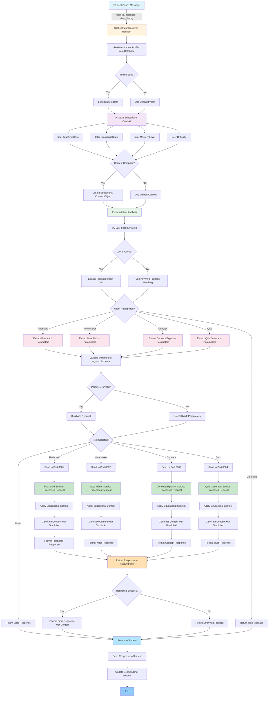

# Autonomous AI Tutor Orchestrator

An intelligent middleware system that connects students to multiple educational tools by understanding context and adapting content based on emotional state, mastery level, and learning style.

## Overview

It is a microservices-based AI tutor orchestrator that intelligently routes student requests to specialized educational tools (flashcard generator, note maker, concept explainer, quiz generator) while personalizing the experience based on each student's unique learning profile.

Instead of a one-size-fits-all approach, the system analyzes:
- What the student is asking for (intent recognition)
- Who the student is (profile and context)
- What they need right now (emotional state, mastery level)
- How they learn best (teaching style preference)

Then it generates perfectly tailored educational content.

## Key Features

Educational Context Awareness: The system adapts teaching style, content complexity, and tone based on student's emotional state, mastery level, and learning preferences.

Multi-Tool Integration: Seamlessly routes requests to the most appropriate educational tool (flashcards, notes, concept explanations, or quizzes).

Intelligent Parameter Extraction: Understands what parameters are needed for each tool and infers missing information from conversation context.

Scalable Architecture: Microservices design allows easy addition of 80+ educational tools without modifying core orchestrator.

Graceful Error Handling: Fallback mechanisms ensure the system continues working even when components fail.

Personalized Learning Paths: Generates customized learning recommendations based on student progress and mastery level.

## System Architecture

```
Orchestrator (Core Logic)
  ├── Intent Recognition (determines which tool to use)
  ├── Parameter Extraction (figures out what data to send)
  ├── Educational Context Analysis (adapts to student needs)
  └── Tool Dispatch (sends requests to appropriate service)

Educational Tool Services (Specialized Microservices)
  ├── Flashcard Generator (port 8001)
  ├── Note Maker (port 8002)
  ├── Concept Explainer (port 8003)
  └── Quiz Generator (port 8004)

Database
  └── PostgreSQL (stores user profiles and sessions)
```

## Prerequisites

Python 3.10 or higher
PostgreSQL 14 or higher
Google API Key (for Gemini LLM)

## Installation

1. Clone the repository:
```bash
git clone <repository-url>
cd YoLearn.ai
```

2. Create a virtual environment:
```bash
python -m venv venv
source venv/bin/activate  # On Windows: venv\Scripts\activate
```

3. Install dependencies:
```bash
pip install -r requirements.txt
```

4. Set up environment variables:
```bash
cp .env.example .env
# Edit .env and add your Google API key
```

5. Start the system:
```bash
uvicorn orchestrator.app.main:app --host 0.0.0.0 --port 8000
uvicorn api_servers.flashcard_generator.app.main:app --host 0.0.0.0 --port 8001
uvicorn api_servers.note_maker.app.main:app --host 0.0.0.0 --port 8002
uvicorn api_servers.concept_explainer.app.main:app --host 0.0.0.0 --port 8003
uvicorn api_servers.quiz_generator.app.main:app --host 0.0.0.0 --port 8004
```

This will start:
- Orchestrator on port 8000
- Flashcard Generator on port 8001
- Note Maker on port 8002
- Concept Explainer on port 8003
- Quiz Generator on port 8004
- PostgreSQL: For postgres, start your postgreSQL server from cmd and make a demo DB

## Screenshot


## Workflow




## Project Structure

```
YoLearn.ai/
├── orchestrator/
│   ├── app/
│   │   ├── main.py           # FastAPI app and endpoints
│   │   ├── workflow.py        # LangGraph workflow logic
│   │   ├── schemas.py         # Pydantic data models
│   │   ├── prompts.py         # LLM prompts
│   │   └── database.py        # Database operations
│   └── requirements.txt
├── api_servers/
│   ├── flashcard_generator/
│   │   └── app/main.py
│   ├── note_maker/
│   │   └── app/main.py
│   ├── concept_explainer/
│   │   └── app/main.py
│   └── quiz_generator/
│       └── app/main.py
├── tests/
│   └── test_orchestrator.py
├── README.md
└── requirements.txt
```

## Quick Start

1. Start all services:

2. Check health of orchestrator:
```bash
curl http://localhost:8000/health
```

3. Send a student message:
```bash
curl -X POST http://localhost:8000/chat \
  -H "Content-Type: application/json" \
  -d '{
    "user_id": "student123",
    "session_id": "session-001",
    "message": "I want to practice flashcards on photosynthesis",
    "chat_history": []
  }'
```

Example response will include personalized flashcards based on the student's profile.

## API Endpoints

Orchestrator (http://localhost:8000)

GET /
- Description: Returns system information
- Response: System name, version, features

GET /health
- Description: Health check
- Response: Status and service name

GET /user/{user_id}
- Description: Get user profile
- Response: User profile with learning preferences and mastery level

POST /chat
- Description: Send a student message
- Request: ChatRequest with user_id, message, chat_history
- Response: ChatResponse with personalized educational content

## Configuration

Environment Variables (.env file):

DATABASE_URL: PostgreSQL connection string
GOOGLE_API_KEY: Your Google API key for Gemini LLM
FLASHCARD_API_URL: URL of flashcard generator service
NOTE_MAKER_API_URL: URL of note maker service
CONCEPT_EXPLAINER_API_URL: URL of concept explainer service
QUIZ_GENERATOR_API_URL: URL of quiz generator service

## Running Tests

Run the test suite:
```bash
pytest tests/test_orchestrator.py -v -s
```

Tests cover:
- Intent recognition across all 4 tools
- Educational context adaptation
- Parameter extraction accuracy
- Error handling

## Educational Context Parameters

The system considers these factors when personalizing content:

Teaching Styles:
- Direct: Clear, step-by-step instruction
- Socratic: Question-based guided discovery
- Visual: Diagrams, imagery, analogies
- Flipped Classroom: Application-focused with assumed prior knowledge

Emotional States:
- Focused: High engagement, ready for challenges
- Anxious: Needs reassurance and simplified approach
- Confused: Requires clarification and breakdown
- Tired: Minimal cognitive load, gentle interaction

Mastery Levels (1-10 scale):
- Levels 1-3: Foundation building with maximum support
- Levels 4-7: Developing competence with guided practice
- Levels 8-10: Advanced application and nuanced understanding

## Example Workflow

1. Student (Alice, Level 3, Visual, Anxious) sends: "Please explain Operating Systems"

2. System analyzes:
   - Intent: concept_explainer
   - Teaching style: visual
   - Emotional state: anxious
   - Difficulty: easy

3. System extracts parameters:
   - concept_to_explain: "Operating Systems"
   - current_topic: "Computer Science"
   - desired_depth: "basic"

4. System dispatches to concept_explainer with all context

5. Tool generates content:
   - Simple, reassuring explanation
   - Visual analogies (mayor, conductor)
   - Real-world examples
   - Visual aids suggestions
   - Step-by-step practice questions

6. Student receives perfectly tailored explanation

## Scaling to 80+ Tools

The current architecture is designed for easy scaling:

1. Each tool is a separate microservice with standard interface
2. Tools are registered in a central registry (not hardcoded)
3. Intent recognition uses keyword matching against registry
4. Parameter extraction is generic and tool-agnostic

To add a new tool:
1. Create new microservice (same interface as existing tools)
2. Add to tool registry with keywords and parameters
3. No changes needed to core orchestrator

## Performance Considerations

The system is designed for scalability:
- Async/await throughout eliminates blocking operations
- Microservices can scale independently
- Tool responses are cacheable
- Keyword-based intent recognition is faster than LLM-only approach

## Troubleshooting

Issue: Tools returning "unknown" intent
Solution: Check that keywords in prompts.py match your messages. Use keyword fallback which is more reliable.

Issue: Pydantic validation errors
Solution: Ensure all required fields in request are present. Check environment variable configuration.

Issue: LLM API timeouts
Solution: The system falls back to keyword matching. Increase timeout in httpx configuration if needed.

Issue: Database connection errors
Solution: Verify DATABASE_URL is correct and PostgreSQL is running. Check credentials in .env file.

## Future Improvements

1. Multi-tool sequences: Support "give notes, then flashcards, then quiz" workflows
2. Learning analytics: Track which tools work best for which students
3. Feedback loops: Learn from student performance to improve recommendations
4. Advanced caching: Cache similar responses to reduce LLM calls
5. Personalization learning: Improve student profile over time based on interactions
6. Mobile app: Build frontend application for mobile access
7. Real-time collaboration: Support group study sessions

## Contributing

To add a new educational tool:

1. Create a new directory in api_servers/
2. Implement FastAPI app with /invoke endpoint
3. Follow the standard request/response format
4. Add Dockerfile
5. Add to docker-compose.yml
6. Register tool in orchestrator configuration
7. Add tests for the new tool

## License

This project is part of the Autonomous AI Tutor Orchestrator hackathon by YoLearn.ai.

## Contact

For questions or issues, please refer to the project documentation or contact the development team.
